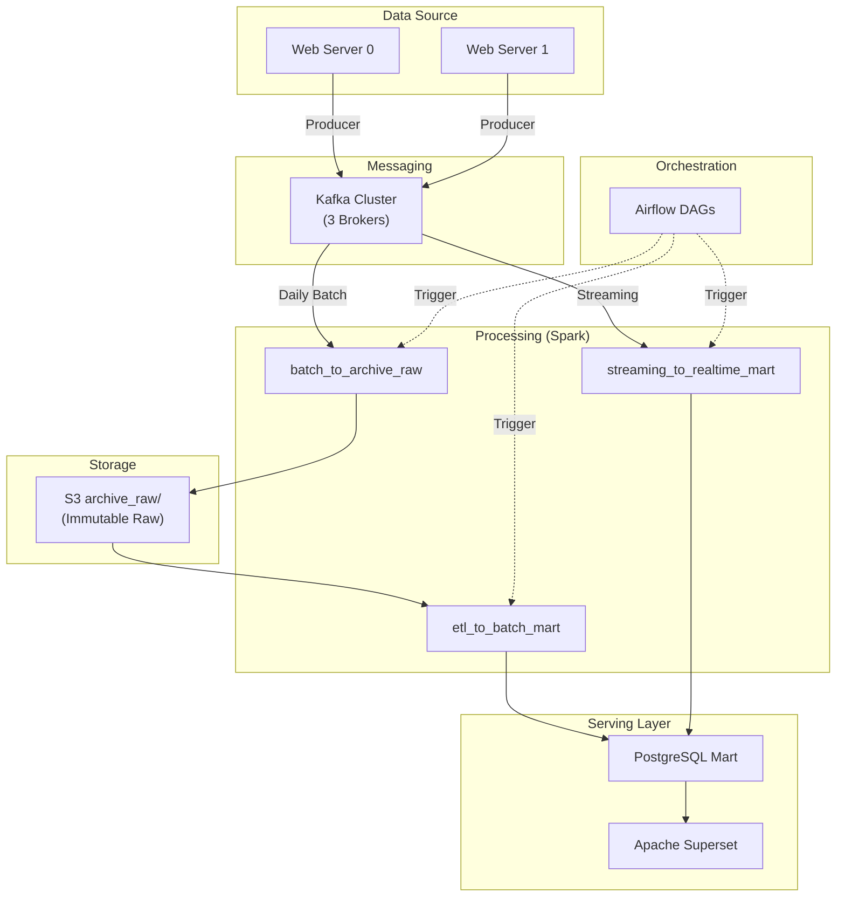

# Clinical Search Data Pipeline

TripClick 임상 데이터 검색 로그를 처리하는 엔드-투-엔드 데이터 파이프라인

## 프로젝트 개요

| 항목 | 내용 |
|------|------|
| 데이터 소스 | TripClick 임상 검색 로그 (JSON) |
| 파이프라인 | Kafka → Spark → S3 (Archive Raw) → PostgreSQL |
| 아키텍처 | Lambda Architecture (배치 + 스트림) |
| 인프라 | Docker Compose 기반 |
| 시각화 | Apache Superset |

---

## 기술 스택

| 구분 | 기술 | 버전 |
|------|------|------|
| 메시징 | Apache Kafka | 7.5.1 (Confluent) |
| 처리 | Apache Spark | 3.4.1 |
| 오케스트레이션 | Apache Airflow | 2.10.5 |
| 저장소 | AWS S3 | - |
| 데이터베이스 | PostgreSQL | 15 |
| 시각화 | Apache Superset | 3.1.0 |
| 컨테이너 | Docker Compose | 3.8 |

---

## 아키텍처 다이어그램



---

## 디렉터리 구조

```
clinical-search-data-pipeline/
│
├── ingestion/                    # 데이터 수집 레이어
│   ├── ingestion.md              # Ingestion 상세 문서
│   ├── producer/                 # Kafka Producer
│   ├── config/                   # 설정 파일
│   └── data/                     # 로그 데이터 (server0, server1)
│
├── messaging/                    # 메시징 인프라 레이어
│   ├── messaging.md              # Messaging 상세 문서
│   └── kafka-compose.yaml        # Kafka 클러스터 구성
│
├── processing/                   # 데이터 처리 레이어
│   ├── processing.md             # Processing 상세 문서
│   ├── spark/                    # Spark 작업
│   │   ├── jobs/
│   │   │   ├── batch_to_archive_raw.py       # Kafka → S3 Archive Raw
│   │   │   ├── etl_to_batch_mart.py          # S3 → PostgreSQL Batch Mart
│   │   │   ├── streaming_to_realtime_mart.py # Kafka → PostgreSQL Realtime Mart
│   │   │   └── consumer_batch.py             # 테스트용
│   │   ├── jars/                 # Spark JARs (Kafka, S3, PostgreSQL)
│   │   └── config/
│   └── spark-compose.yaml        # Spark 클러스터
│
├── orchestration/                # 오케스트레이션 레이어
│   ├── orchestration.md          # Orchestration 상세 문서
│   ├── dags.md                   # DAG 상세 문서
│   ├── dags/
│   │   ├── ingestion/            # Producer DAGs
│   │   ├── processing/           # Spark Job DAGs
│   │   └── pipeline/             # Main Pipeline DAG
│   ├── docker-compose.yaml       # Airflow 클러스터
│   └── Dockerfile
│
├── mart/                         # 서빙 레이어
│   ├── mart.md                   # Mart 상세 문서
│   ├── docker-compose.yaml       # PostgreSQL + Superset
│   ├── postgres/                 # PostgreSQL 설정
│   └── superset/                 # Superset 설정
│
└── infrastructure/               # Technical Architecture
    └── infrastructure.md         # 인프라 기술 아키텍처 문서
```

---

## 데이터 흐름

### Daily Batch Pipeline

```
Producer → Kafka → batch_to_archive_raw → S3 archive_raw → etl_to_batch_mart → PostgreSQL
```

| 단계 | Job | 설명 |
|------|-----|------|
| 1 | Producer | 웹서버 이벤트를 Kafka로 전송 |
| 2 | batch_to_archive_raw | Kafka 전체 데이터를 S3에 Parquet로 저장 |
| 3 | etl_to_batch_mart | S3에서 읽어 중복 제거 후 4개 Batch Mart 생성 |

### Realtime Pipeline

```
Kafka → streaming_to_realtime_mart → PostgreSQL
```

| 단계 | Job | 설명 |
|------|-----|------|
| 1 | streaming_to_realtime_mart | Kafka 스트리밍으로 4개 Realtime Mart 생성 |

---

## 데이터 레이어 정의

| 레이어 | 경로/위치 | 설명 |
|--------|----------|------|
| **Archive Raw** | `s3://tripclick-lake-sangjun/archive_raw/` | 원시 데이터, Kafka 메타데이터 포함, Immutable |
| **Batch Mart** | PostgreSQL `mart_*` 테이블 | 일배치 집계 마트 (T+1) |
| **Realtime Mart** | PostgreSQL `mart_realtime_*` 테이블 | 실시간 집계 마트 (5분 지연) |

---

## Mart 테이블

### Batch Mart (Daily, T+1)

| 테이블 | 설명 |
|--------|------|
| `mart_session_analysis` | 세션별 클릭 분석 |
| `mart_daily_traffic` | 일별 트래픽 집계 |
| `mart_clinical_areas` | 임상 분야별 검색 통계 |
| `mart_popular_documents` | 인기 문서 순위 |

### Realtime Mart (5분 마이크로배치)

| 테이블 | 설명 |
|--------|------|
| `mart_realtime_traffic_minute` | 분 단위 트래픽 |
| `mart_realtime_top_docs_1h` | 인기 문서 TOP 20 |
| `mart_realtime_clinical_trend_24h` | 임상영역 트렌드 |
| `mart_realtime_anomaly_sessions` | 이상징후 감지 |

---

## 레이어별 상세 문서

| 레이어 | 문서 | 설명 |
|--------|------|------|
| Ingestion | [ingestion/ingestion.md](ingestion/ingestion.md) | Kafka Producer, 실시간 전송, dedup 키 |
| Messaging | [messaging/messaging.md](messaging/messaging.md) | Kafka 클러스터, 브로커 구성 |
| Processing | [processing/processing.md](processing/processing.md) | Spark Jobs, Archive Raw, Mart ETL |
| Orchestration | [orchestration/orchestration.md](orchestration/orchestration.md) | Airflow DAG, Remote Docker/SSH |
| Mart | [mart/mart.md](mart/mart.md) | PostgreSQL, Superset |
| Infrastructure | [infrastructure/infrastructure.md](infrastructure/infrastructure.md) | EC2, Network |

---

## 빠른 시작

```bash
# 1. Kafka 클러스터
docker-compose -f messaging/kafka-compose.yaml up -d

# 2. Spark 클러스터
docker-compose -f processing/spark-compose.yaml up -d

# 3. PostgreSQL + Superset
docker-compose -f mart/docker-compose.yaml up -d

# 4. Airflow (Orchestration)
docker-compose -f orchestration/docker-compose.yaml up -d
```

| 서비스 | URL | 계정 |
|--------|-----|------|
| Kafka UI | http://localhost:8080 | - |
| Spark UI | http://localhost:8080 | - |
| Airflow | http://localhost:8080 | admin/admin |
| Superset | http://localhost:8088 | admin/admin |

---

## 설계 원칙

| 원칙 | 설명 |
|------|------|
| 단순화된 아키텍처 | S3 중간 레이어(curated, analytics_mart) 제거, 직접 PostgreSQL 적재 |
| Lambda Architecture | 배치(정합성) + 스트림(실시간) 동시 운영 |
| At-Least-Once + Dedup | dedup_key 기반 중복 제거 |
| Immutable Raw | Archive Raw는 수정 불가, 재처리 기반 |

---

## TODO

- [x] 아키텍처 단순화 (S3 중간 레이어 제거)
- [x] Spark Jobs 통합 (etl_to_batch_mart.py)
- [x] DAG 정리 및 단순화
- [ ] Terraform/CloudFormation 템플릿
- [ ] CI/CD 파이프라인 (GitHub Actions)
- [ ] 모니터링 (Prometheus + Grafana)
- [ ] 알림 설정 (Slack/Email)

---

## 라이선스

MIT License
