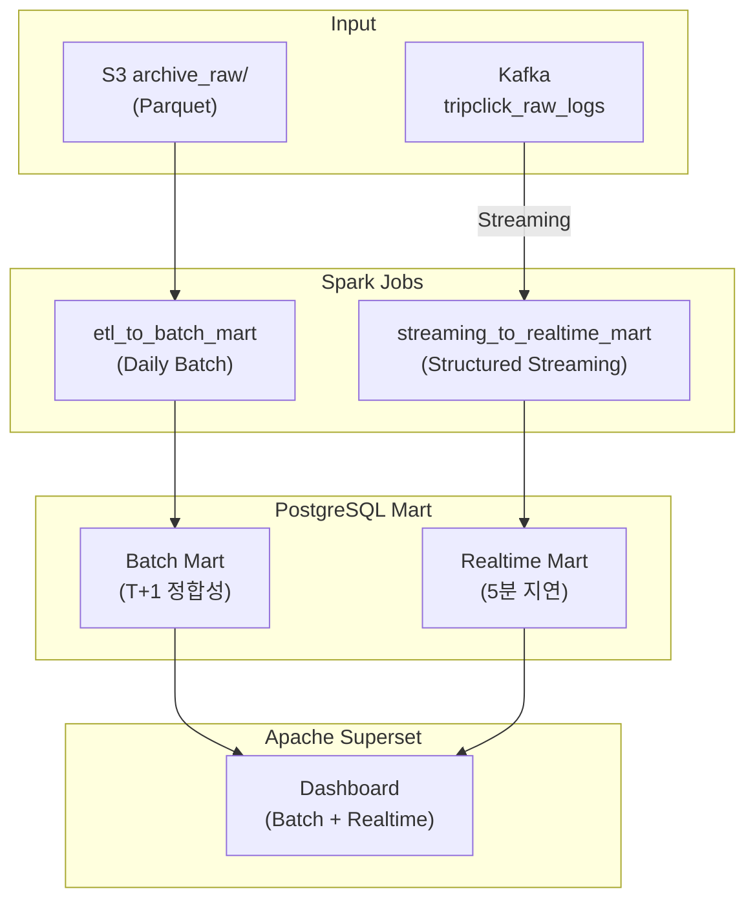

# Mart Layer

분석용 데이터 마트 및 시각화 레이어

## 개요

| 항목 | 내용 |
|------|------|
| Batch 입력 | S3 Archive Raw (Parquet) |
| Realtime 입력 | Kafka (`tripclick_raw_logs`) |
| 출력 | PostgreSQL (마트 테이블) |
| 시각화 | Apache Superset |
| 목적 | 비즈니스 분석 및 대시보드 |

> **Note**: Mart 레이어는 PostgreSQL 테이블로 직접 적재합니다. BI 도구(Superset) 연동 및 실시간 쿼리 성능을 위해 RDB를 선택했습니다.

---

## Batch/Realtime 2계층 Mart 설계

본 프로젝트는 **Lambda Architecture**를 적용하여 "정합성"과 "실시간성"의 균형을 달성합니다.

### 왜 2계층인가?

| 관점 | Realtime Mart (Near Real-Time) | Batch Mart (Daily Batch) |
|------|---------------------------|-------------------------|
| **Freshness** | 5분 지연 | T+1 (하루 1회) |
| **역할** | "지금 상황" 모니터링/데모 | 최종 정합성/리포팅 기준 |
| **데이터 범위** | 최근 1시간~24시간 | 전체 기간 |
| **처리 방식** | 마이크로배치 + Upsert | Full Recompute + Replace |
| **Late Event** | 일부 누락 가능 | Daily 재집계로 보정 |
| **입력 소스** | Kafka 직접 스트리밍 | S3 Archive Raw |

### Freshness SLA

```
┌─────────────────────────────────────────────────────────────────┐
│                    FRESHNESS SLA                                 │
├─────────────────────────────────────────────────────────────────┤
│                                                                  │
│  [REALTIME MART]                [BATCH MART]                     │
│  ────────────                   ───────────                      │
│  • Freshness: 5분               • Freshness: T+1                 │
│  • 입력: Kafka Streaming        • 입력: S3 Archive Raw           │
│  • 방식: Upsert (PK 기반)       • 방식: Full Replace             │
│                                                                  │
│  mart_realtime_traffic_minute   mart_session_analysis            │
│  mart_realtime_top_docs_1h      mart_daily_traffic               │
│  mart_realtime_clinical_trend   mart_clinical_areas              │
│  mart_realtime_anomaly_sessions mart_popular_documents           │
│                                                                  │
└─────────────────────────────────────────────────────────────────┘
```

### 설계 원칙

#### 1. Idempotency (재실행 안전성)

- **Realtime Mart**: PK 기반 `INSERT ... ON CONFLICT DO UPDATE` (Upsert)
  - 동일 윈도우 재처리 시 동일 결과 보장
  - Spark Checkpoint로 exactly-once 시맨틱
- **Batch Mart**: 전체 테이블 `mode("overwrite")`
  - 일배치 재실행 시 동일 결과

#### 2. Late Event 처리

```
Kafka Watermark (10분)
    ↓
Realtime Mart: 최근 짧은 범위만 Near Real-Time 제공
    ↓
Batch Mart: Daily Batch로 전체 재집계 → 최종 정합성 보정
```

- Realtime Mart는 "대략적 최신 데이터" 제공 (일부 누락 허용)
- Batch Mart가 매일 전체 재집계하여 late event 포함

#### 3. 부하/성능 절충

- PostgreSQL은 초당 대량 upsert가 약함
- 설계 제약:
  - 트리거: 5분 마이크로배치 (초 단위 X)
  - 범위: 최근 구간만 집계 (전체 X)
  - 테이블: 스냅샷 방식 활용 (연속 upsert 부담 ↓)

#### 4. Reconciliation (정합성 보정)

- 매일 Batch Mart 배치가 Realtime Mart 범위를 포함하여 재집계
- Realtime Mart의 "대략적 값"을 Batch Mart가 "정답"으로 덮어씀

#### 5. Failure/Retry

- Spark Checkpoint 위치: S3 (`s3a://tripclick-lake-sangjun/checkpoint/realtime_mart/`)
- 재시작 시 마지막 처리 offset부터 재개
- DAG 실패 시 Airflow retry 정책 적용

---

## 아키텍처



### 아스키 아트 버전

```
┌──────────────────────────────────────────────────────────────────────────────┐
│                              MART LAYER                                       │
├──────────────────────────────────────────────────────────────────────────────┤
│                                                                               │
│  ┌─────────────┐          ┌─────────────┐                                     │
│  │   Kafka     │          │ S3 Archive  │                                     │
│  │  (Stream)   │          │    Raw      │                                     │
│  └──────┬──────┘          └──────┬──────┘                                     │
│         │                        │                                            │
│         │                        │                                            │
│         ▼                        ▼                                            │
│  ┌────────────────────┐  ┌────────────────────┐                               │
│  │ Spark Streaming    │  │ Spark Batch ETL    │                               │
│  │ (5분 마이크로배치) │  │ (Daily T+1)        │                               │
│  │                    │  │                    │                               │
│  │ streaming_to_      │  │ etl_to_            │                               │
│  │ realtime_mart.py   │  │ batch_mart.py      │                               │
│  └──────────┬─────────┘  └──────────┬─────────┘                               │
│             │                       │                                         │
│             ▼                       ▼                                         │
│  ┌─────────────────────────────────────────────────────────────┐              │
│  │                     PostgreSQL (Mart)                        │              │
│  ├─────────────────────────────┬───────────────────────────────┤              │
│  │  [REALTIME MART]            │    [BATCH MART]               │              │
│  │   Near Real-Time (5분)      │      Daily Batch (T+1)        │              │
│  │ ─────────────────────────── │ ───────────────────────────── │              │
│  │ mart_realtime_traffic_min   │ mart_session_analysis         │              │
│  │ mart_realtime_top_docs_1h   │ mart_daily_traffic            │              │
│  │ mart_realtime_clinical_24h  │ mart_clinical_areas           │              │
│  │ mart_realtime_anomaly       │ mart_popular_documents        │              │
│  └─────────────────────────────┴───────────────────────────────┘              │
│                                    │                                          │
│                                    ▼                                          │
│                          ┌─────────────────┐                                  │
│                          │    Superset     │                                  │
│                          │   Dashboard     │                                  │
│                          │  (실시간+리포트)│                                  │
│                          └─────────────────┘                                  │
│                                                                               │
└───────────────────────────────────────────────────────────────────────────────┘
```

---

## 디렉터리 구조

```
mart/
├── mart.md                   # 이 문서
├── docker-compose.yaml       # PostgreSQL + Superset 통합 구성
├── postgres/
│   └── init/
│       └── 01_create_tables.sql    # 테이블 초기화
└── superset/
    └── superset_config.py          # Superset 설정

# ETL 코드는 processing 레이어에 위치 (Spark 서버에서 SSHOperator로 실행)
processing/spark/jobs/
├── etl_to_batch_mart.py              # S3 Archive Raw → PostgreSQL Batch Mart
└── streaming_to_realtime_mart.py     # Kafka → PostgreSQL Realtime Mart
```

---

## 데이터 마트 정의

### Realtime Mart (Near Real-Time) 테이블

#### 1. 실시간 트래픽 마트 (`mart_realtime_traffic_minute`)

분 단위 클릭/세션 수 - Superset 라인차트에서 "지금 트래픽이 움직이는 것"을 시각화

| 컬럼 | 타입 | 설명 |
|------|------|------|
| event_minute | TIMESTAMP | 분 단위 버킷 (PK) |
| total_clicks | INT | 총 클릭 수 |
| unique_sessions | INT | 유니크 세션 수 |
| unique_docs | INT | 유니크 문서 수 |
| updated_at | TIMESTAMP | 마지막 갱신 시각 |

- **PK**: `(event_minute)`
- **업데이트**: Upsert (같은 minute 버킷은 값이 커질 수 있음)
- **Superset 차트**: Line Chart (실시간 트래픽 추이)

#### 2. 실시간 인기 문서 TOP N (`mart_realtime_top_docs_1h`)

최근 1시간 기준 인기 문서 랭킹

| 컬럼 | 타입 | 설명 |
|------|------|------|
| snapshot_ts | TIMESTAMP | 스냅샷 시각 |
| rank | INT | 순위 (1~20) |
| document_id | INT | 문서 ID |
| title | VARCHAR | 문서 제목 |
| click_count | INT | 클릭 수 |
| unique_sessions | INT | 유니크 세션 수 |

- **PK**: `(snapshot_ts, rank)`
- **업데이트**: Insert (스냅샷 방식, 최신 snapshot_ts만 조회)
- **Superset 차트**: Table (현재 인기 문서 TOP 20)

#### 3. 실시간 임상영역 트렌드 (`mart_realtime_clinical_trend_24h`)

최근 24시간 임상영역별 관심도

| 컬럼 | 타입 | 설명 |
|------|------|------|
| snapshot_ts | TIMESTAMP | 스냅샷 시각 |
| clinical_area | VARCHAR | 임상 분야 |
| click_count | INT | 클릭 수 |
| unique_sessions | INT | 유니크 세션 수 |
| trend_pct | DECIMAL | 전일 대비 증감률 (%) |

- **PK**: `(snapshot_ts, clinical_area)`
- **업데이트**: Insert (스냅샷 방식)
- **Superset 차트**: Bar Chart + Trend Indicator

#### 4. 이상징후 감지 마트 (`mart_realtime_anomaly_sessions`)

스트리밍의 가치를 가장 잘 보여주는 케이스 - 5분 내 클릭 폭증 세션 감지

| 컬럼 | 타입 | 설명 |
|------|------|------|
| detected_ts | TIMESTAMP | 감지 시각 |
| session_id | VARCHAR | 세션 ID |
| window_start | TIMESTAMP | 윈도우 시작 |
| window_end | TIMESTAMP | 윈도우 종료 |
| click_count | INT | 윈도우 내 클릭 수 |
| severity | VARCHAR | 심각도 (WARNING/CRITICAL) |

- **PK**: `(detected_ts, session_id)`
- **업데이트**: Insert Only (이벤트성 기록)
- **룰**: 5분 내 동일 session_id 클릭 50회 이상 → WARNING, 100회 이상 → CRITICAL
- **Superset 차트**: Alert Table + Time Series

---

### Batch Mart (Daily Batch) 테이블

#### 1. 세션 분석 마트 (`mart_session_analysis`)

세션별 행동 분석

| 컬럼 | 타입 | 설명 |
|------|------|------|
| session_id | VARCHAR | 세션 ID |
| event_date | DATE | 이벤트 날짜 |
| click_count | INT | 클릭 수 |
| unique_docs | INT | 조회 문서 수 |
| first_click_ts | TIMESTAMP | 첫 클릭 시간 |
| last_click_ts | TIMESTAMP | 마지막 클릭 시간 |
| session_duration_sec | INT | 세션 지속 시간 (초) |

### 2. 일별 트래픽 마트 (`mart_daily_traffic`)

일별 트래픽 현황

| 컬럼 | 타입 | 설명 |
|------|------|------|
| event_date | DATE | 날짜 |
| total_events | INT | 총 이벤트 수 |
| unique_sessions | INT | 유니크 세션 수 |
| unique_documents | INT | 조회된 문서 수 |
| peak_hour | INT | 피크 시간대 |

### 3. 임상 분야 마트 (`mart_clinical_areas`)

임상 분야별 관심도 분석

| 컬럼 | 타입 | 설명 |
|------|------|------|
| event_date | DATE | 날짜 |
| clinical_area | VARCHAR | 임상 분야 |
| search_count | INT | 검색 수 |
| unique_sessions | INT | 유니크 세션 수 |

### 4. 인기 문서 마트 (`mart_popular_documents`)

인기 문서 순위

| 컬럼 | 타입 | 설명 |
|------|------|------|
| event_date | DATE | 날짜 |
| document_id | INT | 문서 ID |
| title | VARCHAR | 문서 제목 |
| view_count | INT | 조회 수 |
| unique_sessions | INT | 조회 세션 수 |

---

## Spark ETL Jobs

Airflow SSHOperator를 통해 Spark 서버에서 직접 실행됩니다.

### etl_to_batch_mart.py

S3 Archive Raw 데이터를 읽어 중복 제거 후 PostgreSQL Batch Mart 테이블로 적재

```python
# 주요 변환 로직
# 1. S3 Archive Raw 데이터 읽기
archive_df = spark.read.parquet(S3_ARCHIVE_RAW_PATH)

# 2. dedup_key 기준 중복 제거
deduped_df = (
    archive_df
    .dropDuplicates(["dedup_key"])
)

# 3. 세션 분석 마트
session_mart = (
    deduped_df
    .groupBy("session_id", "event_date")
    .agg(
        count("*").alias("click_count"),
        countDistinct("document_id").alias("unique_docs"),
        min("event_ts").alias("first_click_ts"),
        max("event_ts").alias("last_click_ts"),
    )
)

# 4. PostgreSQL 적재 (JDBC)
session_mart.write \
    .format("jdbc") \
    .option("url", jdbc_url) \
    .option("dbtable", "mart_session_analysis") \
    .mode("overwrite") \
    .save()
```

### streaming_to_realtime_mart.py

Kafka에서 직접 스트리밍으로 읽어 PostgreSQL Realtime Mart 테이블로 적재

```python
# 주요 구성
# 1. Kafka 스트리밍 읽기
kafka_df = (
    spark.readStream
    .format("kafka")
    .option("kafka.bootstrap.servers", KAFKA_BROKERS)
    .option("subscribe", "tripclick_raw_logs")
    .option("startingOffsets", "latest")
    .load()
)

# 2. Watermark + 중복 제거
deduped_df = (
    parsed_df
    .withWatermark("event_ts", "10 minutes")
    .dropDuplicates(["dedup_key"])
)

# 3. 집계 및 PostgreSQL Upsert (foreachBatch)
def write_to_postgres(batch_df, batch_id):
    # 분 단위 트래픽 집계
    traffic_df = batch_df.groupBy(
        window("event_ts", "1 minute").alias("event_minute")
    ).agg(...)

    # Upsert 로직
    upsert_to_postgres(traffic_df, "mart_realtime_traffic_minute")

query = deduped_df.writeStream \
    .foreachBatch(write_to_postgres) \
    .trigger(processingTime="5 minutes") \
    .start()
```

---

## PostgreSQL 설정

PostgreSQL과 Superset은 `mart/docker-compose.yaml`에 통합 구성되어 있습니다.

### PostgreSQL 서비스

```yaml
postgres-mart:
  image: postgres:15
  container_name: postgres-mart
  environment:
    POSTGRES_USER: mart
    POSTGRES_PASSWORD: mart_password
    POSTGRES_DB: tripclick_mart
  ports:
    - "5433:5432"
  volumes:
    - postgres-mart-data:/var/lib/postgresql/data
    - ./postgres/init:/docker-entrypoint-initdb.d
  networks:
    - mart-network
```

### 테이블 초기화 (01_create_tables.sql)

```sql
-- ===========================
-- Batch Mart Tables (T+1)
-- ===========================

-- 세션 분석 마트
CREATE TABLE IF NOT EXISTS mart_session_analysis (
    session_id VARCHAR(50),
    event_date DATE,
    click_count INT,
    unique_docs INT,
    first_click_ts TIMESTAMP,
    last_click_ts TIMESTAMP,
    session_duration_sec INT,
    PRIMARY KEY (session_id, event_date)
);

-- 일별 트래픽 마트
CREATE TABLE IF NOT EXISTS mart_daily_traffic (
    event_date DATE PRIMARY KEY,
    total_events INT,
    unique_sessions INT,
    unique_documents INT,
    peak_hour INT
);

-- 임상 분야 마트
CREATE TABLE IF NOT EXISTS mart_clinical_areas (
    event_date DATE,
    clinical_area VARCHAR(100),
    search_count INT,
    unique_sessions INT,
    PRIMARY KEY (event_date, clinical_area)
);

-- 인기 문서 마트
CREATE TABLE IF NOT EXISTS mart_popular_documents (
    event_date DATE,
    document_id INT,
    title VARCHAR(500),
    view_count INT,
    unique_sessions INT,
    PRIMARY KEY (event_date, document_id)
);

-- ===========================
-- Realtime Mart Tables (5분)
-- ===========================

-- 실시간 트래픽 (분 단위)
CREATE TABLE IF NOT EXISTS mart_realtime_traffic_minute (
    event_minute TIMESTAMP PRIMARY KEY,
    total_clicks INT,
    unique_sessions INT,
    unique_docs INT,
    updated_at TIMESTAMP DEFAULT NOW()
);

-- 실시간 인기 문서 TOP 20
CREATE TABLE IF NOT EXISTS mart_realtime_top_docs_1h (
    snapshot_ts TIMESTAMP,
    rank INT,
    document_id INT,
    title VARCHAR(500),
    click_count INT,
    unique_sessions INT,
    PRIMARY KEY (snapshot_ts, rank)
);

-- 실시간 임상영역 트렌드
CREATE TABLE IF NOT EXISTS mart_realtime_clinical_trend_24h (
    snapshot_ts TIMESTAMP,
    clinical_area VARCHAR(100),
    click_count INT,
    unique_sessions INT,
    trend_pct DECIMAL(5,2),
    PRIMARY KEY (snapshot_ts, clinical_area)
);

-- 이상징후 감지
CREATE TABLE IF NOT EXISTS mart_realtime_anomaly_sessions (
    detected_ts TIMESTAMP,
    session_id VARCHAR(50),
    window_start TIMESTAMP,
    window_end TIMESTAMP,
    click_count INT,
    severity VARCHAR(20),
    PRIMARY KEY (detected_ts, session_id)
);

-- ===========================
-- Indexes
-- ===========================
CREATE INDEX idx_session_date ON mart_session_analysis(event_date);
CREATE INDEX idx_clinical_date ON mart_clinical_areas(event_date);
CREATE INDEX idx_popular_date ON mart_popular_documents(event_date);
CREATE INDEX idx_traffic_minute ON mart_realtime_traffic_minute(event_minute);
CREATE INDEX idx_top_docs_snapshot ON mart_realtime_top_docs_1h(snapshot_ts);
CREATE INDEX idx_anomaly_detected ON mart_realtime_anomaly_sessions(detected_ts);
```

---

## Apache Superset 설정

Superset은 `mart/docker-compose.yaml`에 통합 구성되어 있으며, `mart-network`를 통해 postgres-mart와 연결됩니다.

### Superset 서비스

```yaml
superset:
  image: apache/superset:3.1.0
  container_name: superset
  ports:
    - "8088:8088"
  volumes:
    - ./superset/superset_config.py:/app/pythonpath/superset_config.py
  depends_on:
    - superset-db
    - postgres-mart
  networks:
    - mart-network
```

### Superset Database 연결

Superset UI에서 PostgreSQL Mart DB 연결:

```
Database: PostgreSQL
Host: postgres-mart
Port: 5432
Database: tripclick_mart
Username: mart
Password: mart_password
```

---

## 대시보드 구성

### 1. 실시간 모니터링 (Realtime Mart)
- 실시간 트래픽 추이 (Line Chart) - `mart_realtime_traffic_minute`
- 현재 인기 문서 TOP 20 (Table) - `mart_realtime_top_docs_1h`
- 임상영역 트렌드 (Bar Chart) - `mart_realtime_clinical_trend_24h`
- 이상징후 알림 (Alert Table) - `mart_realtime_anomaly_sessions`

### 2. 일별 리포트 (Batch Mart)
- 일별 트래픽 개요 (Line Chart) - `mart_daily_traffic`
- 피크 시간대 분포 (Heatmap) - `mart_daily_traffic`
- 임상 분야별 검색 비율 (Pie Chart) - `mart_clinical_areas`
- Top 20 인기 문서 (Table) - `mart_popular_documents`

### 3. 세션 행동 분석 (Batch Mart)
- 세션 지속 시간 분포 (Histogram) - `mart_session_analysis`
- 클릭 수 분포 (Box Plot) - `mart_session_analysis`

---

## DAG 구성

| DAG ID | 유형 | 스케줄 | 역할 |
|--------|------|--------|------|
| `tripclick_batch_mart` | Batch | 수동/Daily | S3 Archive Raw → PostgreSQL Batch Mart |
| `tripclick_realtime_mart` | Realtime | 수동 (1시간 실행) | Kafka Streaming → PostgreSQL Realtime Mart |

---

## 실행 방법

```bash
cd mart

# 1. PostgreSQL + Superset 시작 (통합)
docker-compose up -d

# 2. ETL 실행 (Spark 서버에서 실행)
# Airflow DAG 또는 수동 실행

# Batch Mart (S3 → PostgreSQL)
docker exec spark-master spark-submit \
  --master spark://spark-master:7077 \
  /opt/spark/jobs/etl_to_batch_mart.py

# Realtime Mart (Kafka → PostgreSQL Streaming)
docker exec spark-master spark-submit \
  --master spark://spark-master:7077 \
  /opt/spark/jobs/streaming_to_realtime_mart.py

# 3. Superset 접속
# http://localhost:8088 (admin/admin)
```

---

## TODO

- [x] Spark ETL 코드 작성 (etl_to_batch_mart.py)
- [x] Streaming 코드 작성 (streaming_to_realtime_mart.py)
- [x] 자동화 스케줄링 (Airflow SSHOperator 연동)
- [x] Batch/Realtime 2계층 Mart 설계
- [x] Realtime Mart 테이블 스키마 정의
- [ ] Superset 대시보드 템플릿
- [ ] 데이터 품질 검증 로직
