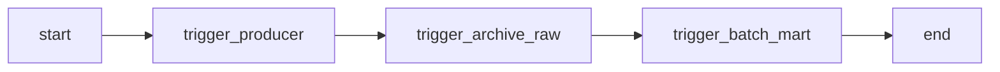

# TripClick DAGs 구성

## 개요

기능별로 DAG을 분리하여 구성하며, 메인 오케스트레이션 DAG에서 `TriggerDagRunOperator`로 순차 호출합니다.

---

## 디렉터리 구조

```
dags/
├── ingestion/
│   ├── tripclick_producer_batch_dag.py      # Producer (배치)
│   └── tripclick_producer_realtime_dag.py   # Producer (실시간)
│
├── processing/
│   ├── tripclick_spark_archive_raw_dag.py   # Kafka → S3 Archive Raw
│   ├── tripclick_batch_mart_dag.py          # S3 → PostgreSQL Batch Mart
│   └── tripclick_realtime_mart_dag.py       # Kafka → PostgreSQL Realtime Mart
│
└── pipeline/
    └── tripclick_main_dag.py                # 메인 오케스트레이션
```

---

## DAG 상세 정의

### 1. Ingestion: tripclick_producer_batch_dag.py

| 항목 | 값 |
|------|-----|
| DAG ID | `tripclick_producer_batch` |
| 스케줄 | `None` (수동 실행) |
| Operator | `DockerOperator` |
| 목적 | 과거 데이터 백필 / 일괄 전송 |

```
start → producer_server0_batch → end
        producer_server1_batch
```

---

### 2. Ingestion: tripclick_producer_realtime_dag.py

| 항목 | 값 |
|------|-----|
| DAG ID | `tripclick_producer_realtime` |
| 스케줄 | `None` (수동 실행) |
| Operator | `DockerOperator` |
| 목적 | 실시간 스트리밍 시뮬레이션 |

```
start → producer_server0_realtime → end
```

---

### 3. Processing: tripclick_spark_archive_raw_dag.py

| 항목 | 값 |
|------|-----|
| DAG ID | `tripclick_spark_archive_raw_batch` |
| 스케줄 | `None` (수동 실행) |
| Operator | `SSHOperator` |
| Spark Job | `batch_to_archive_raw.py` |
| 목적 | Kafka → S3 Archive Raw 배치 적재 |

```
start → batch_to_archive_raw → end
```

---

### 4. Processing: tripclick_batch_mart_dag.py

| 항목 | 값 |
|------|-----|
| DAG ID | `tripclick_batch_mart` |
| 스케줄 | `None` (수동 실행) |
| Operator | `SSHOperator` |
| Spark Job | `etl_to_batch_mart.py` |
| 목적 | S3 Archive Raw → PostgreSQL Batch Mart |

**생성되는 테이블:**

| 테이블 | 설명 |
|--------|------|
| `mart_session_analysis` | 세션별 클릭 분석 |
| `mart_daily_traffic` | 일별 트래픽 집계 |
| `mart_clinical_areas` | 임상 분야별 검색 통계 |
| `mart_popular_documents` | 인기 문서 순위 |

```
start → etl_to_batch_mart → end
```

---

### 5. Processing: tripclick_realtime_mart_dag.py

| 항목 | 값 |
|------|-----|
| DAG ID | `tripclick_realtime_mart` |
| 스케줄 | `None` (수동/독립 실행) |
| Operator | `SSHOperator` |
| Spark Job | `streaming_to_realtime_mart.py` |
| 목적 | Kafka → PostgreSQL Realtime Mart (Streaming) |

**생성되는 테이블:**

| 테이블 | 설명 | 업데이트 방식 |
|--------|------|---------------|
| `mart_realtime_traffic_minute` | 분 단위 트래픽 | Upsert |
| `mart_realtime_top_docs_1h` | 인기 문서 TOP 20 | Append (스냅샷) |
| `mart_realtime_clinical_trend_24h` | 임상영역 트렌드 | Append (스냅샷) |
| `mart_realtime_anomaly_sessions` | 이상징후 감지 | Append |

```
start → streaming_to_realtime_mart → end
```

> **Note**: 이 DAG은 Daily Pipeline과 별도로 독립 실행됩니다. 1시간 실행 후 자동 종료되며, 지속 운영 시 재시작이 필요합니다.

---

### 6. Pipeline: tripclick_main_dag.py

| 항목 | 값 |
|------|-----|
| DAG ID | `tripclick_daily_pipeline` |
| 스케줄 | `0 15 * * *` (KST 00:00) |
| Operator | `TriggerDagRunOperator` |
| 목적 | Daily Batch Pipeline 오케스트레이션 |



| 단계 | 트리거 DAG | 설명 |
|------|-----------|------|
| 1 | `tripclick_producer_batch` | 웹서버 이벤트를 Kafka로 전송 |
| 2 | `tripclick_spark_archive_raw_batch` | Kafka → S3 Archive Raw |
| 3 | `tripclick_batch_mart` | S3 → PostgreSQL Batch Mart |

---

## Airflow 설정

### Variables

| Key | 설명 | 예시 |
|-----|------|------|
| `KAFKA_BROKERS` | Kafka 브로커 주소 | `10.0.1.10:9092` |
| `S3_ARCHIVE_RAW_PATH` | Archive Raw 경로 | `s3a://tripclick-lake-sangjun/archive_raw/` |
| `S3_CHECKPOINT_PATH` | Checkpoint 경로 | `s3a://tripclick-lake-sangjun/checkpoint/` |
| `WEBSERVER_INGESTION_PATH` | 웹서버 경로 | `/home/ubuntu` |

### Connections

| Conn ID | Type | 설명 |
|---------|------|------|
| `docker_server0` | Docker | 웹서버 0 Docker API |
| `spark_ssh` | SSH | Spark 서버 SSH 연결 |
| `aws_s3` | AWS | S3 접근용 IAM 자격증명 |
| `postgres_mart` | Postgres | PostgreSQL Mart |

---

## 테스트 순서

1. **Airflow 기동 확인**: Webserver, Scheduler, Worker 정상 동작 확인
2. **Variables/Connections 설정**: UI 또는 CLI로 등록
3. **DAG 단위 테스트**: 아래 순서로 수동 실행
   ```
   tripclick_producer_batch
   → tripclick_spark_archive_raw_batch
   → tripclick_batch_mart
   ```
4. **Realtime 테스트**: `tripclick_realtime_mart` 수동 실행
5. **메인 DAG 테스트**: `tripclick_daily_pipeline` 수동 실행

---

## 아키텍처 요약

```
┌──────────────────────────────────────────────────────────────────────────┐
│                         DATA PIPELINE                                     │
├──────────────────────────────────────────────────────────────────────────┤
│                                                                           │
│  [BATCH PATH]                          [REALTIME PATH]                    │
│  ─────────────                         ────────────────                   │
│  tripclick_producer_batch              tripclick_realtime_mart            │
│         ↓                                     ↓                           │
│  tripclick_spark_archive_raw_batch     Kafka Streaming                    │
│         ↓                                     ↓                           │
│  tripclick_batch_mart                  PostgreSQL Realtime Marts          │
│         ↓                                                                 │
│  PostgreSQL Batch Marts                                                   │
│                                                                           │
├──────────────────────────────────────────────────────────────────────────┤
│                           PostgreSQL                                      │
│                              ↓                                            │
│                          Superset                                         │
│                     (Batch + Realtime 대시보드)                           │
└──────────────────────────────────────────────────────────────────────────┘
```

---

## 진행 상황

| DAG | 상태 | 비고 |
|-----|------|------|
| `tripclick_producer_batch` | ✅ 완료 | DockerOperator |
| `tripclick_producer_realtime` | ✅ 완료 | DockerOperator |
| `tripclick_spark_archive_raw_batch` | ✅ 완료 | SSHOperator |
| `tripclick_batch_mart` | ✅ 완료 | SSHOperator |
| `tripclick_realtime_mart` | ✅ 완료 | SSHOperator (Streaming) |
| `tripclick_daily_pipeline` | ✅ 완료 | TriggerDagRunOperator |
