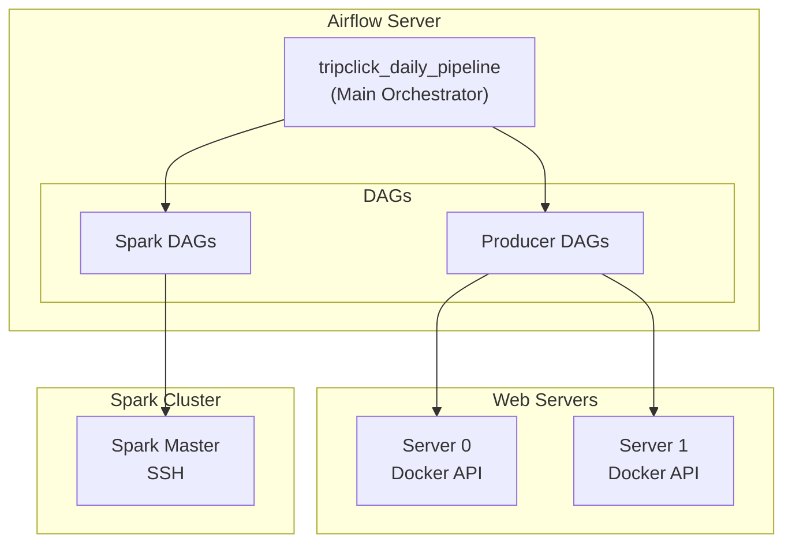
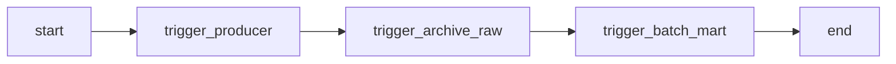
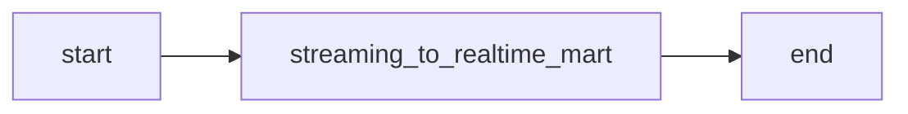

# Orchestration Layer

전체 파이프라인을 오케스트레이션하는 Airflow 서버

## 개요

| 항목 | 내용 |
|------|------|
| 역할 | DAG 관리 및 스케줄링 |
| 위치 | 별도 EC2 인스턴스 |
| 연동 | Remote Docker API (Producer), SSHOperator (Spark) |

---

## 아키텍처



---

## 디렉터리 구조

```
orchestration/
├── orchestration.md          # 이 문서
├── dags.md                   # DAG 상세 문서
├── docker-compose.yaml       # Airflow 클러스터
├── Dockerfile
├── requirements.txt
├── dags/
│   ├── ingestion/
│   │   ├── tripclick_producer_batch_dag.py      # Producer (배치)
│   │   └── tripclick_producer_realtime_dag.py   # Producer (실시간)
│   ├── processing/
│   │   ├── tripclick_spark_archive_raw_dag.py   # Kafka → S3
│   │   ├── tripclick_batch_mart_dag.py          # S3 → PostgreSQL
│   │   └── tripclick_realtime_mart_dag.py       # Kafka → PostgreSQL (Streaming)
│   └── pipeline/
│       └── tripclick_main_dag.py                # 메인 오케스트레이션
└── config/
    └── spark_key.pem         # Spark SSH 키
```

---

## DAG 구성

### Daily Pipeline (tripclick_daily_pipeline)



| 단계 | 트리거 DAG | 설명 |
|------|-----------|------|
| 1 | `tripclick_producer_batch` | 웹서버 이벤트를 Kafka로 전송 |
| 2 | `tripclick_spark_archive_raw_batch` | Kafka → S3 Archive Raw |
| 3 | `tripclick_batch_mart` | S3 → PostgreSQL Batch Mart |

### Realtime Pipeline (독립 실행)



`tripclick_realtime_mart` DAG은 Daily Pipeline과 별도로 독립 실행됩니다.

---

## DAG 목록

| DAG ID | 위치 | Operator | 설명 |
|--------|------|----------|------|
| `tripclick_producer_batch` | ingestion/ | DockerOperator | 배치 Producer |
| `tripclick_producer_realtime` | ingestion/ | DockerOperator | 실시간 Producer |
| `tripclick_spark_archive_raw_batch` | processing/ | SSHOperator | Kafka → S3 |
| `tripclick_batch_mart` | processing/ | SSHOperator | S3 → PostgreSQL |
| `tripclick_realtime_mart` | processing/ | SSHOperator | Kafka → PostgreSQL (Streaming) |
| `tripclick_daily_pipeline` | pipeline/ | TriggerDagRunOperator | 메인 오케스트레이션 |

---

## SSHOperator 사용 이유

SparkSubmitOperator의 Client Mode 네트워크 문제로 SSHOperator로 전환:

### 문제 상황

- Airflow와 Spark가 다른 서버의 Docker 컨테이너에서 실행
- Client Mode에서 Driver-Executor 간 Docker Bridge Network 통신 불가

### 해결책

```
Airflow Server → SSH → Spark Server → docker exec spark-submit
```

- Spark 서버에서 직접 `docker exec spark-master spark-submit` 실행
- 네트워크 문제 완전 회피
- 수동 실행과 동일한 동작 보장

---

## Airflow Connections

```bash
# Spark SSH Connection
airflow connections add spark_ssh \
  --conn-type ssh \
  --conn-host <SPARK_SERVER_IP> \
  --conn-login ubuntu \
  --conn-extra '{"key_file": "/opt/airflow/config/spark_key.pem"}'

# Docker Connection (Web Server 0)
airflow connections add docker_server0 \
  --conn-type docker \
  --conn-host tcp://<WEBSERVER0_IP>:2375

# AWS S3 Connection
airflow connections add aws_s3 \
  --conn-type aws \
  --conn-login <ACCESS_KEY> \
  --conn-password <SECRET_KEY>

# PostgreSQL Mart Connection
airflow connections add postgres_mart \
  --conn-type postgres \
  --conn-host <POSTGRES_HOST> \
  --conn-port 5432 \
  --conn-login mart \
  --conn-password <PASSWORD> \
  --conn-schema tripclick_mart
```

---

## Airflow Variables

| Key | 설명 | 예시 |
|-----|------|------|
| `KAFKA_BROKERS` | Kafka 브로커 주소 | `10.0.1.10:9092` |
| `S3_ARCHIVE_RAW_PATH` | Archive Raw 경로 | `s3a://tripclick-lake-sangjun/archive_raw/` |
| `S3_CHECKPOINT_PATH` | Checkpoint 경로 | `s3a://tripclick-lake-sangjun/checkpoint/` |
| `WEBSERVER_INGESTION_PATH` | 웹서버 경로 | `/home/ubuntu` |

---

## 실행 방법

```bash
cd orchestration

# 권한 설정
sudo chown -R 50000:0 logs dags plugins config

# 시작
docker compose up -d

# 웹 UI 접속
# http://localhost:8080 (admin/admin)
```

---

## TODO

- [x] DAG 구조 단순화
- [x] SSHOperator 방식 구현
- [ ] Connection 초기화 스크립트 완성
- [ ] 모니터링 대시보드 (Grafana)
- [ ] 알림 설정 (Slack/Email)
