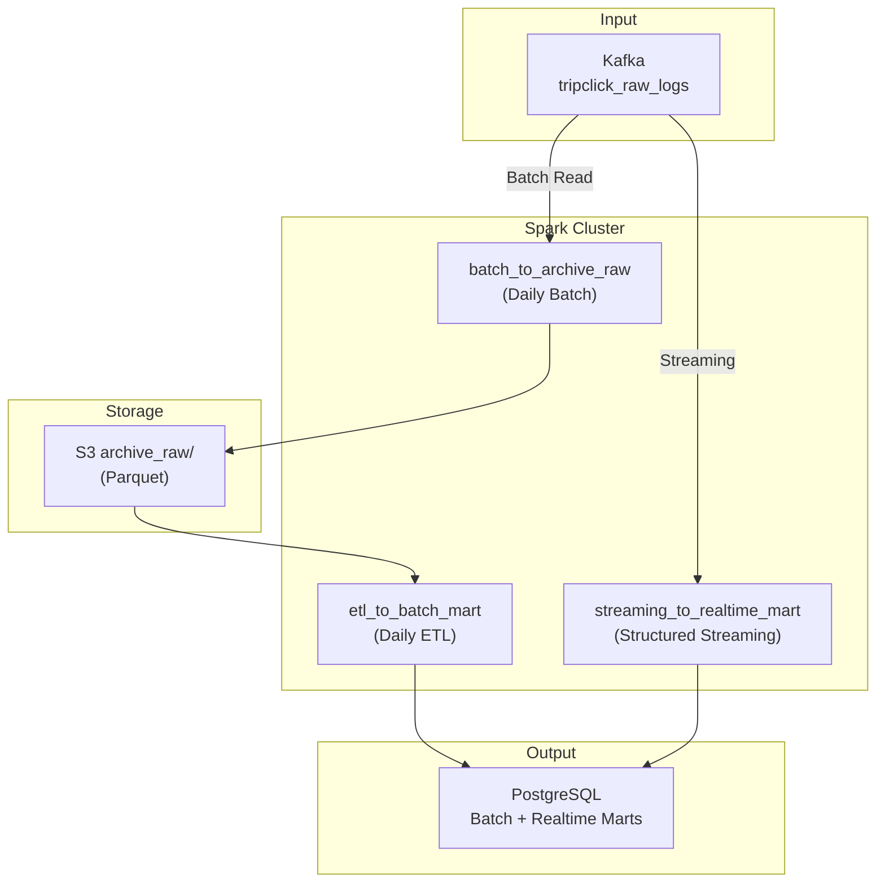

# Processing Layer

Kafka 데이터를 처리하여 S3 및 PostgreSQL에 저장하는 레이어

## 개요

| 항목 | 내용 |
|------|------|
| 입력 | Kafka 토픽 (`tripclick_raw_logs`), S3 Archive Raw |
| 출력 | S3 Archive Raw, PostgreSQL Mart |
| 처리 엔진 | Apache Spark 3.4.1 |
| 오케스트레이션 | Apache Airflow (별도 서버) |

---

## 아키텍처



---

## 디렉터리 구조

```
processing/
├── spark/
│   ├── jobs/
│   │   ├── batch_to_archive_raw.py       # Kafka → S3 Archive Raw
│   │   ├── etl_to_batch_mart.py          # S3 → PostgreSQL Batch Mart
│   │   ├── streaming_to_realtime_mart.py # Kafka → PostgreSQL Realtime Mart
│   │   └── consumer_batch.py             # 테스트용
│   ├── jars/                             # Spark JARs
│   │   ├── spark-sql-kafka-0-10_2.12-3.4.1.jar
│   │   ├── kafka-clients-3.3.2.jar
│   │   ├── commons-pool2-2.11.1.jar
│   │   ├── spark-token-provider-kafka-0-10_2.12-3.4.1.jar
│   │   ├── hadoop-aws-3.3.4.jar
│   │   ├── aws-java-sdk-bundle-1.12.262.jar
│   │   └── postgresql-42.6.0.jar
│   ├── config/
│   │   └── config.yaml
│   └── Dockerfile
└── spark-compose.yaml
```

---

## Spark Jobs

### 1. batch_to_archive_raw.py

Kafka 전체 데이터를 배치로 읽어 S3 Archive Raw에 저장

| 항목 | 내용 |
|------|------|
| 실행 주기 | Daily |
| 입력 | Kafka (earliest → latest) |
| 출력 | S3 Archive Raw (Parquet) |
| 파티션 | event_date |

```bash
docker exec spark-master spark-submit \
  --master spark://spark-master:7077 \
  --conf spark.hadoop.fs.s3a.access.key=${AWS_ACCESS_KEY_ID} \
  --conf spark.hadoop.fs.s3a.secret.key=${AWS_SECRET_ACCESS_KEY} \
  --conf spark.hadoop.fs.s3a.impl=org.apache.hadoop.fs.s3a.S3AFileSystem \
  /opt/spark/jobs/batch_to_archive_raw.py
```

---

### 2. etl_to_batch_mart.py

S3 Archive Raw 데이터를 읽어 중복 제거 후 PostgreSQL Batch Mart에 적재

| 항목 | 내용 |
|------|------|
| 실행 주기 | Daily (batch_to_archive_raw 이후) |
| 입력 | S3 Archive Raw |
| 출력 | PostgreSQL (4개 Batch Mart) |
| 중복 제거 | dedup_key 기준 |

**생성되는 Mart 테이블:**

| 테이블 | 설명 |
|--------|------|
| `mart_session_analysis` | 세션별 클릭 분석 |
| `mart_daily_traffic` | 일별 트래픽 집계 |
| `mart_clinical_areas` | 임상 분야별 검색 통계 |
| `mart_popular_documents` | 인기 문서 순위 |

```bash
docker exec spark-master spark-submit \
  --master spark://spark-master:7077 \
  --conf spark.hadoop.fs.s3a.access.key=${AWS_ACCESS_KEY_ID} \
  --conf spark.hadoop.fs.s3a.secret.key=${AWS_SECRET_ACCESS_KEY} \
  /opt/spark/jobs/etl_to_batch_mart.py
```

---

### 3. streaming_to_realtime_mart.py

Kafka에서 직접 스트리밍으로 읽어 PostgreSQL Realtime Mart에 적재

| 항목 | 내용 |
|------|------|
| 실행 방식 | Structured Streaming (1시간 실행) |
| 입력 | Kafka (startingOffsets=latest) |
| 출력 | PostgreSQL (4개 Realtime Mart) |
| 트리거 | 5분 마이크로배치 |
| 중복 제거 | Watermark(10분) + dedup_key |

**생성되는 Mart 테이블:**

| 테이블 | 설명 | 업데이트 방식 |
|--------|------|---------------|
| `mart_realtime_traffic_minute` | 분 단위 트래픽 | Upsert |
| `mart_realtime_top_docs_1h` | 인기 문서 TOP 20 | Append (스냅샷) |
| `mart_realtime_clinical_trend_24h` | 임상영역 트렌드 | Append (스냅샷) |
| `mart_realtime_anomaly_sessions` | 이상징후 감지 | Append |

```bash
docker exec spark-master spark-submit \
  --master spark://spark-master:7077 \
  --conf spark.hadoop.fs.s3a.access.key=${AWS_ACCESS_KEY_ID} \
  --conf spark.hadoop.fs.s3a.secret.key=${AWS_SECRET_ACCESS_KEY} \
  /opt/spark/jobs/streaming_to_realtime_mart.py
```

---

## 데이터 레이어 정의

### Archive Raw Layer (원시 데이터)

- **목적**: 원본 데이터 보존 (Immutable, Data Lineage)
- **특징**: Kafka 메타데이터 포함, 중복 허용
- **경로**: `s3://tripclick-lake-sangjun/archive_raw/`
- **파티션**: `event_date=YYYY-MM-DD`

### PostgreSQL Mart Layer

- **Batch Mart**: 일배치로 전체 재계산 (T+1 정합성)
- **Realtime Mart**: 스트리밍으로 실시간 갱신 (5분 지연)

---

## JAR 의존성

`processing/spark/jars/` 디렉토리에 다음 JAR 파일 필요:

| JAR | 용도 |
|-----|------|
| `spark-sql-kafka-0-10_2.12-3.4.1.jar` | Kafka 커넥터 |
| `kafka-clients-3.3.2.jar` | Kafka 클라이언트 |
| `commons-pool2-2.11.1.jar` | 커넥션 풀 |
| `spark-token-provider-kafka-0-10_2.12-3.4.1.jar` | Kafka 토큰 |
| `hadoop-aws-3.3.4.jar` | S3A 파일시스템 |
| `aws-java-sdk-bundle-1.12.262.jar` | AWS SDK |
| `postgresql-42.6.0.jar` | PostgreSQL JDBC |

Docker Compose에서 `./spark/jars:/opt/spark/jars`로 마운트됩니다.

---

## 환경변수

```bash
# Kafka
export KAFKA_BROKERS="broker1:9092,broker2:9093,broker3:9094"

# S3
export S3_ARCHIVE_RAW_PATH="s3a://tripclick-lake-sangjun/archive_raw/"
export S3_CHECKPOINT_PATH="s3a://tripclick-lake-sangjun/checkpoint/"
export AWS_ACCESS_KEY_ID="..."
export AWS_SECRET_ACCESS_KEY="..."

# PostgreSQL
export POSTGRES_HOST="postgres-mart"
export POSTGRES_PORT="5432"
export POSTGRES_DB="tripclick_mart"
export POSTGRES_USER="mart"
export POSTGRES_PASSWORD="mart_password"
```

---

## 실행 순서 (Daily Pipeline)

```
15:00  Producer 시작 (Kafka로 이벤트 전송)
       ↓
16:00  Producer 종료
       ↓
17:00  batch_to_archive_raw 실행 (Kafka → S3)
       ↓
18:00  etl_to_batch_mart 실행 (S3 → PostgreSQL)
       ↓
       완료
```

Realtime 파이프라인은 별도로 `streaming_to_realtime_mart`를 상시 실행합니다.

---

## 테스트 가이드

### 1단계: Spark 클러스터 실행

```bash
cd processing
docker-compose -f spark-compose.yaml up -d

# Spark UI 확인: http://localhost:8080
```

### 2단계: Batch Job 테스트

```bash
# Archive Raw 적재
docker exec -it spark-master spark-submit \
  --master spark://spark-master:7077 \
  /opt/spark/jobs/batch_to_archive_raw.py

# Batch Mart 적재
docker exec -it spark-master spark-submit \
  --master spark://spark-master:7077 \
  /opt/spark/jobs/etl_to_batch_mart.py
```

### 3단계: Streaming Job 테스트

```bash
docker exec -it spark-master spark-submit \
  --master spark://spark-master:7077 \
  /opt/spark/jobs/streaming_to_realtime_mart.py
```

---

## TODO

- [x] Spark Jobs 단순화 (6개 → 3개)
- [x] JAR 마운트 방식으로 변경
- [x] PostgreSQL 직접 적재
- [ ] Spark 클러스터 설정 최적화
- [ ] 모니터링 (Spark UI, Prometheus)
- [ ] 실패 시 알림 (Slack/Email)
